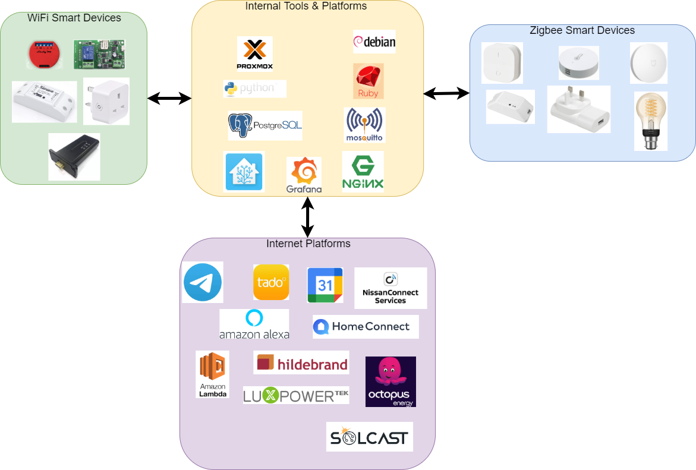

# Home Automation
## Background
I started out on my home automation journey in the summer of 2019. I attended a short presentation by a colleague where he was presenting how he was using Home Assistant. I was intrigued by what I saw and decided to to look into it for our own purposes.

Since then I have expanded out from just Home Assistant. I have learnt how to integrate ESP8266 embedded devices (Smart Pugs and Relays) with MQTT - this then exposes these as entities and sensors in Home Assistant. I have also discovered how to use Zigbee devices from almost any manufacturer with Home Assistant. Lately I have now also integrated my House Solar and Battery control system into Home Assistant.

My current vision is to ensue that I make best and most economical use of electricity. I receive my energy from Octopus and the two plans that I have tried are Octopus Go (5p per kWh between 00.30-04.30) and Agile. Both of these are Time of Use Tariff's (ToU) and with Agile the also offer an export plan that varies in price too. By combining the sensor data and control data from Home Assistant with usage and price data from Octopus I hope to be able to set automatic and variable charging cycles for both the House Battery and our Nissan Leaf too.

What I hope to do on this Github site is to share what I have done along with the code and config snippets so others can experiment too.

## Acknowledgements
99% of what I have been able to build would not have been possible if it wasn't for the work of others and by them sharing their knowledge and work. I hope to continue this culture of sharing my own ideas and work so that it may help others like me.

## Overview
The outline of what I have built is shown in the diagram below. The Home Assistant component plays a key role for both controlling and collating data from a large array of devices and services. However, I have found that it benefits from being supported by other components too. For example, although Home Assistant has a very capable database layer built within its product container, by moving the database out of the container I found that as well as a performance boost, that I can now easily use the same database for storing other data. This then lends its self to being able to use all the data in there in dashboards created in another told called Grafana. This is obviously a risk with this approach where by the complexity increases to a point where the management overhead negates any benefit so I need to be careful.

## Logical Integration Overview
In the previous section i talked a little about what  have built or what I consume from. The diagram below goes a step further and shows the high-level connections between the components within the system. This is broken down by where it is installed\ hosted (Internal or external) and also if its dedicated hardware too (ie. Zigbee gateway).

## Component List
Below are a list of all of the components draw out within the diagram in the previous section. For each component I will try and show not only what it is but also why I selected it, what function it is performing and what value it is delivering.

1. [Home Assistant](./components/HomeAssistant.md)
2. Tasmota Platform
3. Zigbee Network
4. Philips Hue Platform
5. Pod-Point Electric Vehicle Charger
6. Reverse Proxy Platform - NGINX
7. Storage & Integration Platform - Mosquito MQTT and Postgres Database
8. Dashboard Platform - Grafana
9. Batch Platform - Custom Scripts
10. LuxPower Platform (Internal)
11. LuxPower Platform (External)
12. HilderBrand Glow Platform
13. Solcast Platform
14. Octopus Platform
15. Home Connect
16. Tado
17. Google
18. Amazon
19. NissanConnect