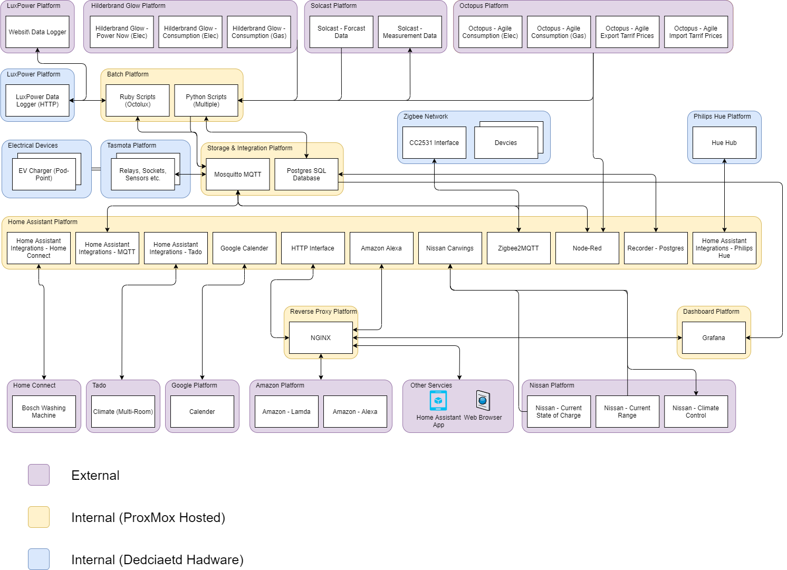

# Home Automation
## Background
I started out on my home automation journey in the summer of 2019. I attended a short presentation by a colleague where he was presenting how he was using Home Assistant. I was intrigued by what I saw and decided to to look into it for our own purposes.

Since then I have expanded out from just Home Assistant. I have learnt how to integrate ESP8266 embedded devices (Smart Pugs and Relays) with MQTT - this then exposes these as entities and sensors in Home Assistant. I have also discovered how to use Zigbee devices from almost any manufacturer with Home Assistant. Lately I have now also integrated my House Solar and Battery control system into Home Assistant.

My current vision is to ensue that I make best and most economical use of electricity. I receive my energy from Octopus and the two plans that I have tried are Octopus Go (5p per kWh between 00.30-04.30) and Agile. Both of these are Time of Use Tariff's (ToU) and with Agile the also offer an export plan that varies in price too. By combining the sensor data and control data from Home Assistant with usage and price data from Octopus I hope to be able to set automatic and variable charging cycles for both the House Battery and our Nissan Leaf too.

What I hope to do on this Github site is to share what I have done along with the code and config snippets so others can experiment too.

## Acknowledgements
99% of what I have been able to build would not have been possible if it wasn't for the work of others and by them sharing their knowledge and work. I hope to continue this culture of sharing my own ideas and work so that it may help others like me.

## Why Home Assistant
After doing some initial investigation into Home Assistant I started thinking about Use Cases where it could add value. Initially this started with problem the most basic and common use case "I want to turn a light on & off". From there it expanded to where I know use Home Assistant to control when and also by how much I charge my Electric Car and also house battery. These later two use cases are not only convenient but they will also help significantly reduce our costs on electricity as well as ensuring we do not over charge either thereby preserving, to some degree the batteries State of Health (SoH).

I have found Home Assistant provides a lot of the Out of the Box Functions as well as a plethora of 3rd party add on's that extend it even further. One of the most beneficial Add On's is the Node Red component that has proved to be both an excellent Rapid Application Design (RAD) tool as well as a more production like execution engine too.

Lastly, even though Home Assistant provides its own internal database, I have recently start to experiment with different database (DB) storage platforms which Home Assistant also supports.I have now decided to move to an external Postgres DB instance. Movuing to this external DB allows me to query the data stored on it more easily with tools such as Grafana, as well as running my own Python scripts again it.

## Physical Overview
The Home Assistant platform provides a way of both controlling and collating data from a large array of devices. In my setup I can group these into 3 distinct groups.

1. Smart Devices that are connect via WiFi. These are devices such as Smart Sockets and Smart Relays
2. Zigbee Devices that either capture senor data or control relays.
3. Internet hosted services that either provide sensor information or expose services (eg. EV Climate Control)

The diagram below shows some of the deices and services I use.

## Logical Integration Overview
In the previous 2 sections I briefly described why I chose to use Home Assistant and what I use it to interact with. The diagram below goes a step further and shows the high-level connections between the components within Home Assistant as well as those I have installed and built around it and also those I use externally.

## Component List
Below are a list of all of the components draw out in the diagram above. For each component I will try and show not only what it is but also why I selected it, what function it is performing and what value it is delivering.