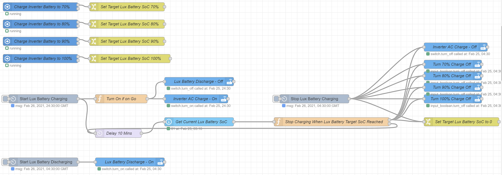

# Configuration Extract and Script Summary

Below are a number of Python scripts that I use to carry out regular automated functions. These range from maintenance jobs such as rebooting functions through to data downloads from Solcast for solar predictions. In addition there are a number of extracted sections of relevant Home Assistant configurations that enable some of all of the sensors, switches and automation's.

## Python
Most if not all of the Python scripts will use the [config.ini](./python/config.ini) file to retrieve variable values like IP addresses and user names.

### [LuxPower_Data_Logger_Reboot.py](./python/LuxPower_Data_Logger_Reboot.py)
I have found that overtime the LuxPower Data Logger can become unstable and requires rebooting. One way can be to reboot it is by un-plugging it from the Inverter and then re-plugging it back in. Another is to load up the Web Console and click on the reboot button. This script uses a test automation framework, Selenium, to mimic this second approach.

To use this script ensure you install the pre-requisites listed in the script and also ensure the values in the config.ini file are correct ie. Data Logger IP address. For details on the Cron Job I use see the Cron Section.

## Cron
I execute a number of functions on a regular basis - some are to ensure system stability. The Cron Table for these is shown below.

Restart Octolux every hour at 15 minutes past the hour to prevent MQTT failures

`15 */1 * * * /bin/systemctl restart octolux_server.service`

On a daily basis stop Octolux, Reboot the LuxPower Data Logger and then re-start Octolux with a minutes gap between them all

`55 23 * * * /bin/systemctl stop octolux_server.service`

`56 23 * * * (cd /root/scripts/ && /usr/bin/python3 /root/scripts/LuxPower_Data_Logger_Reboot.py)`

`57 23 * * * /bin/systemctl start octolux_server.service`

## Home Assistant `configuration.yaml`
### [LuxPower](./yaml/configuration-lux.yaml)
In order to both record and access functions on the LuxPower platform the integration from OctoLux to Home Assistant via MQTT needs to be configured. Assuming that OctoLux is running correctly and both posting and receiving messages via MQTT and that the MQTT Home Assistant Integration is also configured correctly the last step is to define the Sensors and switches. Within the extract yaml file `configuration-lux.yaml` are the sensors and switches that I created for my system. Cutting and pasting these into the `configuraiton.yaml` file will tell Home Assistant which MQTT queues to use for both reading status from LuxPower and also sending messages to it like AC Charge.

## Home Assistant `automations.yaml`
### [LuxPower](./yaml/automations-lux.yaml)
Within my setup I have created some Boolean switches that I use to tell the Inverter to Charge to 80%, 90% or 100%. While there is no prediction routines running I have setup up Node-Red to charge the battery to 80% each night unless I ask it to charge to 90% or 100% (mostly to balance the battery). The automation's were created to make sure the Booleans are all kept in sync and do not override each other. Note, these are really only needed when using the Node-Red flow.

## Home Assistant - Node-Red
The following additional nodes are used within the shared flow:

* node-red-contrib-cron-plus

### [LuxPower Request Update](./node-red/NodeRed-Lux-RequstUpdate.json)
I use Node to regularly ask the Inverter to post an update. I do this as I wish to get an update more regularly than once every 2 minutes (default). The current Node-Red flow is set to request an update every 15 seconds. Note, make sure the MQTT IP address is set correctly within the flow.

### [LuxPower Octopus Go](./node-red/NodeRed-Lux-OctopusGo.json)
I use Node-Red to automatically charge the battery each night between 00:30 and 04:30. It also ensures that the Target State of Charge (SoC) is archived and then charging is stopped. The last thing is does is to turn battery discharge on at 04:30 as there is no benefit in discharging the battery when the kWh price is at 5p.

### LuxPower Octopus Agile
TBC